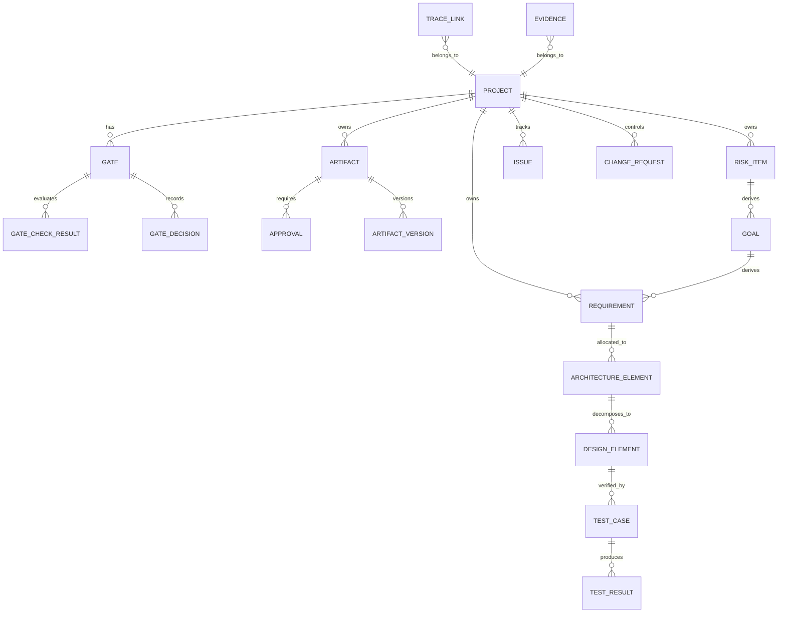

# 데이터 모델

## 1. 모델링 원칙

데이터 모델은 데모 프로그램의 화면, 게이트 체크, 리포트 생성을 모두 지원해야 한다. 따라서 산출물 파일 자체보다 산출물의 메타데이터, 상태, 관계, 증거 링크를 구조화해서 저장한다.

## 2. 핵심 엔티티



## 3. 엔티티 상세

### 3.1 Project

| 필드 | 타입 | 설명 |
|---|---|---|
| project_id | string | PRJ-EPB-001 |
| name | string | 프로젝트명 |
| description | text | 개요 |
| domain | string | ECU, ADAS, Body, Powertrain 등 |
| lifecycle_model | string | V-Model, Agile-V 등 |
| target_aspice_level | string | 예: CL2 |
| safety_applicable | boolean | ISO 26262 적용 여부 |
| cybersecurity_applicable | boolean | ISO/SAE 21434 적용 여부 |
| current_gate_id | string | 현재 게이트 |
| status | enum | Active, Suspended, Released, Closed |
| created_at | datetime | 생성일 |
| updated_at | datetime | 수정일 |

### 3.2 Gate

| 필드 | 타입 | 설명 |
|---|---|---|
| gate_id | string | GATE-G3 |
| project_id | string | 프로젝트 ID |
| code | string | G0~G7 |
| name | string | 게이트명 |
| phase | string | P0~P7 |
| entry_criteria | list | 진입 기준 |
| exit_criteria | list | 종료 기준 |
| required_artifact_types | list | 필수 산출물 유형 |
| required_roles | list | 필수 승인 역할 |
| status | enum | Not Started, In Review, Passed, Conditional Passed, Failed |
| planned_date | date | 계획일 |
| actual_date | date | 실제 완료일 |

### 3.3 GateCheckResult

| 필드 | 타입 | 설명 |
|---|---|---|
| check_result_id | string | 결과 ID |
| gate_id | string | 게이트 ID |
| check_id | string | GC-G3-001 등 |
| title | string | 체크 항목명 |
| result | enum | Pass, Fail, Not Applicable |
| blocking | boolean | 실패 시 게이트 차단 여부 |
| evidence_ids | list | 증거자료 ID |
| issue_id | string | 실패 시 생성된 이슈 |
| comment | text | 검토 의견 |

### 3.4 Artifact

| 필드 | 타입 | 설명 |
|---|---|---|
| artifact_id | string | ART-SRS-001 |
| project_id | string | 프로젝트 ID |
| template_id | string | TPL-013 |
| artifact_type | string | SRS, HARA, TARA 등 |
| title | string | 산출물명 |
| version | string | 버전 |
| status | enum | Draft, In Review, Rejected, Approved, Baselined, Change Requested, Obsolete |
| owner | string | 소유자 |
| standard_area | list | ASPICE, ISO 26262, ISO/SAE 21434 |
| related_gate_ids | list | 관련 게이트 |
| storage_uri | string | 파일 또는 객체 저장 위치 |
| baseline_id | string | 기준선 ID |
| created_at | datetime | 생성일 |
| updated_at | datetime | 수정일 |

### 3.5 RiskItem

HARA의 Hazard와 TARA의 Threat를 공통 리스크 항목으로 관리한다.

| 필드 | 타입 | 설명 |
|---|---|---|
| risk_item_id | string | HAZ-001 또는 THR-001 |
| project_id | string | 프로젝트 ID |
| risk_type | enum | Safety, Cybersecurity |
| item_id | string | 관련 Item |
| title | string | 위험/위협명 |
| scenario | text | 운용/공격 시나리오 |
| cause_or_vector | text | 고장 원인 또는 공격 벡터 |
| effect_or_damage | text | 결과 또는 피해 |
| severity | string | S0~S3 또는 영향도 |
| exposure | string | E0~E4 |
| controllability | string | C0~C3 |
| attack_feasibility | string | Low/Medium/High 등 |
| risk_level | string | QM/ASIL A~D 또는 Low~High |
| treatment | enum | Accept, Avoid, Mitigate, Transfer |
| residual_risk | string | 잔여 리스크 |
| status | enum | Draft, In Review, Approved, Baselined |

### 3.6 Goal

| 필드 | 타입 | 설명 |
|---|---|---|
| goal_id | string | SG-001 또는 CSG-001 |
| project_id | string | 프로젝트 ID |
| goal_type | enum | Safety, Cybersecurity |
| source_risk_item_id | string | Hazard/Threat ID |
| statement | text | 목표 문장 |
| asil_or_cal | string | ASIL 또는 CAL |
| rationale | text | 도출 근거 |
| status | enum | Draft, In Review, Approved, Baselined |

### 3.7 Requirement

| 필드 | 타입 | 설명 |
|---|---|---|
| requirement_id | string | SYSREQ-001, SWREQ-001, SAFREQ-001, SECREQ-001 |
| project_id | string | 프로젝트 ID |
| requirement_type | enum | Stakeholder, System, Software, Safety, Cybersecurity |
| statement | text | 요구사항 문장 |
| rationale | text | 근거 |
| source_ids | list | 상위 항목 |
| verification_method | enum | Review, Analysis, Test, Inspection |
| priority | enum | Must, Should, Could |
| asil_or_cal | string | ASIL/CAL |
| status | enum | Draft, In Review, Approved, Baselined, Change Requested |
| owner | string | 담당자 |

### 3.8 ArchitectureElement

| 필드 | 타입 | 설명 |
|---|---|---|
| architecture_element_id | string | ARCH-001 |
| project_id | string | 프로젝트 ID |
| architecture_type | enum | System, Software |
| name | string | 요소명 |
| description | text | 설명 |
| interface_ids | list | 인터페이스 |
| allocated_requirement_ids | list | 할당 요구사항 |
| safety_mechanism | text | 안전 메커니즘 |
| security_mechanism | text | 보안 메커니즘 |
| status | enum | Draft, In Review, Approved, Baselined |

### 3.9 DesignElement

| 필드 | 타입 | 설명 |
|---|---|---|
| design_element_id | string | DESIGN-001 |
| project_id | string | 프로젝트 ID |
| architecture_element_id | string | 상위 아키텍처 요소 |
| name | string | 상세설계 요소명 |
| description | text | 설명 |
| code_module | string | 코드 모듈 경로 또는 식별자 |
| allocated_requirement_ids | list | 할당 요구사항 |
| status | enum | Draft, In Review, Approved, Baselined |

### 3.10 TestCase

| 필드 | 타입 | 설명 |
|---|---|---|
| test_case_id | string | TC-001 |
| project_id | string | 프로젝트 ID |
| test_level | enum | Unit, Integration, System, Safety, Cybersecurity |
| title | string | 테스트명 |
| objective | text | 목적 |
| verified_requirement_ids | list | 검증 대상 요구사항 |
| precondition | text | 사전 조건 |
| procedure | list | 절차 |
| expected_result | text | 기대 결과 |
| status | enum | Draft, In Review, Approved, Baselined |

### 3.11 TestResult

| 필드 | 타입 | 설명 |
|---|---|---|
| test_result_id | string | TR-001 |
| test_case_id | string | 테스트 케이스 ID |
| execution_date | datetime | 수행일 |
| result | enum | Pass, Fail, Blocked, Not Run |
| actual_result | text | 실제 결과 |
| defect_issue_id | string | 결함 이슈 |
| evidence_ids | list | 로그, 리포트, 스크린샷 등 |
| executor | string | 수행자 |

### 3.12 TraceLink

| 필드 | 타입 | 설명 |
|---|---|---|
| trace_link_id | string | TRACE-001 |
| project_id | string | 프로젝트 ID |
| source_type | string | Hazard, Threat, Goal, Requirement 등 |
| source_id | string | 출발 ID |
| target_type | string | Goal, Requirement, TestCase 등 |
| target_id | string | 대상 ID |
| relation | enum | derives, refines, satisfies, allocates, verifies, mitigates, evidences |
| status | enum | Valid, Suspect, Invalid |
| rationale | text | 관계 근거 |

### 3.13 Evidence

| 필드 | 타입 | 설명 |
|---|---|---|
| evidence_id | string | EVD-001 |
| project_id | string | 프로젝트 ID |
| evidence_type | enum | ReviewRecord, TestLog, AnalysisReport, ToolReport, ApprovalRecord |
| title | string | 증거명 |
| storage_uri | string | 파일 위치 |
| related_entity_type | string | TestResult, GateDecision 등 |
| related_entity_id | string | 관련 항목 ID |
| created_at | datetime | 생성일 |

### 3.14 Issue

| 필드 | 타입 | 설명 |
|---|---|---|
| issue_id | string | ISS-001 |
| project_id | string | 프로젝트 ID |
| title | string | 이슈명 |
| description | text | 설명 |
| severity | enum | Low, Medium, High, Critical |
| category | enum | Process, Requirement, Design, Test, Safety, Cybersecurity, Tool |
| status | enum | Open, In Progress, Resolved, Closed, Deferred |
| owner | string | 담당자 |
| due_date | date | 기한 |
| related_entity_ids | list | 관련 항목 |

### 3.15 ChangeRequest

| 필드 | 타입 | 설명 |
|---|---|---|
| change_request_id | string | CR-001 |
| project_id | string | 프로젝트 ID |
| title | string | 변경명 |
| reason | text | 변경 사유 |
| impact_summary | text | 영향 요약 |
| affected_entity_ids | list | 영향 대상 |
| safety_impact | enum | None, Low, Medium, High |
| cybersecurity_impact | enum | None, Low, Medium, High |
| decision | enum | Pending, Approved, Rejected, Deferred |
| status | enum | Open, Implementing, Verified, Closed |

## 4. 게이트 자동 판정 로직

게이트 판정 엔진은 아래 순서로 평가한다.

1. 게이트의 필수 산출물 유형을 조회한다.
2. 프로젝트 내 해당 산출물이 존재하는지 확인한다.
3. 산출물 상태가 `Approved` 또는 `Baselined`인지 확인한다.
4. 필수 추적성 규칙을 조회하고 누락 링크를 찾는다.
5. `High` 또는 `Critical` 오픈 이슈가 있는지 확인한다.
6. 안전/보안 잔여 리스크가 승인되지 않았는지 확인한다.
7. 필수 승인 역할의 승인 기록을 확인한다.
8. 실패한 차단 항목이 있으면 `Fail`, 차단 항목은 없지만 조건부 항목이 있으면 `Conditional Pass`, 모두 충족하면 `Pass`로 판정한다.

## 5. 필수 추적성 규칙

| Rule ID | 적용 게이트 | Source | Target | 관계 | 필수 |
|---|---|---|---|---|---|
| TR-G2-001 | G2 | Hazard | SafetyGoal | derives | Yes |
| TR-G2-002 | G2 | Threat | CybersecurityGoal | derives | Yes |
| TR-G3-001 | G3 | SafetyGoal | SystemRequirement | derives | Yes |
| TR-G3-002 | G3 | CybersecurityGoal | SystemRequirement | derives | Yes |
| TR-G3-003 | G3 | SystemRequirement | SoftwareRequirement | refines | Yes |
| TR-G4-001 | G4 | Requirement | ArchitectureElement | allocates | Yes |
| TR-G5-001 | G5 | SoftwareRequirement | DesignElement | allocates | Yes |
| TR-G5-002 | G5 | DesignElement | TestCase | verified_by | Yes |
| TR-G6-001 | G6 | Requirement | TestCase | verifies | Yes |
| TR-G6-002 | G6 | TestCase | TestResult | produces | Yes |
| TR-G7-001 | G7 | TestResult | Evidence | evidences | Yes |
| TR-G7-002 | G7 | Evidence | SafetyCase/CybersecurityCase | supports | Yes |

## 6. 초기 샘플 데이터

MVP 데모용 기본 프로젝트는 전동 파킹 브레이크 제어 ECU로 한다.

```yaml
project:
  project_id: PRJ-EPB-001
  name: "Electric Parking Brake Control ECU"
  target_aspice_level: CL2
  safety_applicable: true
  cybersecurity_applicable: true
  current_gate_id: GATE-G1

sample_risks:
  - risk_item_id: HAZ-001
    risk_type: Safety
    title: "주행 중 의도치 않은 제동"
    severity: S3
    exposure: E4
    controllability: C3
    risk_level: ASIL D
  - risk_item_id: THR-001
    risk_type: Cybersecurity
    title: "CAN 메시지 위조를 통한 제동 명령 주입"
    attack_feasibility: Medium
    risk_level: High
```

