# 통합 프로세스 맵

## 1. 프로세스 범위

대상 프로세스는 자동차 ECU/임베디드 SW 개발을 기준으로 한다. ASPICE를 기본 개발 프로세스 골격으로 사용하고, ISO 26262 기능안전 활동과 ISO/SAE 21434 사이버보안 활동을 각 단계의 필수 또는 조건부 활동으로 연결한다.

## 2. 생명주기 단계

| Phase | 단계 | 목적 | 관련 게이트 |
|---|---|---|---|
| P0 | 프로젝트 착수 | 프로젝트 범위, 적용 표준, 역할, 테일러링 기준 확정 | G0 |
| P1 | 아이템/컨텍스트 정의 | 개발 대상, 운용 환경, 시스템 경계, 이해관계자 요구 파악 | G1 |
| P2 | 리스크 분석 | HARA/TARA 수행, 안전/보안 목표 도출 | G2 |
| P3 | 요구사항 기준선 | 시스템/SW/안전/보안 요구사항 정의 및 기준선 수립 | G3 |
| P4 | 아키텍처 정의 | 시스템/SW 구조와 안전/보안 컨셉 정의 | G4 |
| P5 | 상세설계 및 구현 준비 | 상세설계, 구현 규칙, 단위 검증 준비 | G5 |
| P6 | 구현 및 통합 검증 | 코드, 단위 테스트, 통합 테스트, 요구사항 검증 수행 | G6 |
| P7 | 릴리즈 승인 | 잔여 리스크, 추적성, 검증 증거, Safety/Security Case 승인 | G7 |

## 3. 표준별 활동 매핑

| Phase | ASPICE 중심 활동 | 기능안전 활동 | 사이버보안 활동 | 주요 결과 |
|---|---|---|---|---|
| P0 | MAN.3, SUP.1, SUP.8 계획 수립 | Safety Plan 수립 | Cybersecurity Plan 수립 | 프로젝트 계획과 테일러링 확정 |
| P1 | SYS.1 이해관계자 요구사항 수집 | Item Definition | Cybersecurity Item Definition | 개발 대상과 경계 확정 |
| P2 | SYS.1/SYS.2 입력 정제 | HARA, ASIL 결정, Safety Goal | TARA, CAL/위험등급 결정, Cybersecurity Goal | 리스크 기반 목표 도출 |
| P3 | SYS.2, SWE.1 요구사항 정의 | FSC, TSR, Safety Requirement | Cybersecurity Requirement, Cybersecurity Concept 요구 | 기준선 요구사항 확정 |
| P4 | SYS.3, SWE.2 아키텍처 | TSC, 안전 메커니즘, FFI/공존 분석 | 보안 아키텍처, 공격 표면 저감 설계 | 설계 구조와 요구사항 할당 |
| P5 | SWE.3 상세설계 | SW Safety Requirement 상세화 | Security Requirement 상세화 | 구현 가능한 설계 기준 |
| P6 | SWE.4/5/6, SYS.4/5 검증 | Safety Verification, Safety Validation 증거 | Cybersecurity Verification, Vulnerability Analysis | 테스트 결과와 증거 확보 |
| P7 | SUP.1/8/9, MAN.3 종료 판단 | Safety Case, Confirmation Review 입력 | Cybersecurity Case, Cybersecurity Assessment 입력 | 릴리즈 승인 |

## 4. 역할 정의

| Role | 책임 |
|---|---|
| Project Manager | 일정, 범위, 리소스, 게이트 운영 책임 |
| Process/QA Manager | ASPICE 프로세스 준수, 품질 보증, 산출물 감사 |
| System Engineer | 시스템 요구사항, 시스템 아키텍처, 시스템 검증 책임 |
| Software Engineer | SW 요구사항, SW 설계, 구현, 단위/통합 검증 책임 |
| Safety Manager | Safety Plan, HARA, Safety Concept, Safety Case 책임 |
| Cybersecurity Manager | Cybersecurity Plan, TARA, Security Concept, Cybersecurity Case 책임 |
| Verification Lead | 테스트 전략, 테스트 사양, 검증 결과, 결함 추적 책임 |
| Configuration Manager | 기준선, 변경관리, 형상 식별, 릴리즈 패키지 책임 |

## 5. 통합 추적성 흐름

```mermaid
flowchart LR
  Stakeholder["Stakeholder Need"]
  Item["Item Definition"]
  Hazard["Hazard / Threat"]
  Goal["Safety Goal / Cybersecurity Goal"]
  SysReq["System Requirement"]
  SwReq["Software Requirement"]
  Arch["Architecture Element"]
  Design["Detailed Design / Code Module"]
  Test["Test Case"]
  Result["Test Result / Evidence"]
  Case["Safety Case / Cybersecurity Case"]
  Gate["Gate Approval"]

  Stakeholder --> Item
  Item --> Hazard
  Hazard --> Goal
  Goal --> SysReq
  SysReq --> SwReq
  SwReq --> Arch
  Arch --> Design
  Design --> Test
  Test --> Result
  Result --> Case
  Case --> Gate
```

## 6. 상태 모델

모든 관리 대상은 동일한 상태 흐름을 기본으로 사용한다.

| 상태 | 의미 | 다음 상태 |
|---|---|---|
| Draft | 작성 중 | In Review, Obsolete |
| In Review | 검토 중 | Approved, Rejected |
| Rejected | 보완 필요 | Draft, In Review |
| Approved | 승인 완료, 기준선 후보 | Baselined, Change Requested |
| Baselined | 기준선 확정 | Change Requested |
| Change Requested | 변경 요청 발생 | Draft, In Review, Obsolete |
| Obsolete | 폐기 또는 대체 | 없음 |

## 7. ID 체계

| 대상 | 접두어 | 예시 |
|---|---|---|
| 프로젝트 | PRJ | PRJ-EPB-001 |
| 게이트 | GATE | GATE-G3 |
| 산출물 | ART | ART-SRS-001 |
| 아이템 | ITEM | ITEM-EPB-001 |
| Hazard | HAZ | HAZ-001 |
| Threat | THR | THR-001 |
| Safety Goal | SG | SG-001 |
| Cybersecurity Goal | CSG | CSG-001 |
| 시스템 요구사항 | SYSREQ | SYSREQ-001 |
| SW 요구사항 | SWREQ | SWREQ-001 |
| 안전 요구사항 | SAFREQ | SAFREQ-001 |
| 보안 요구사항 | SECREQ | SECREQ-001 |
| 아키텍처 요소 | ARCH | ARCH-001 |
| 테스트 케이스 | TC | TC-001 |
| 테스트 결과 | TR | TR-001 |
| 이슈 | ISS | ISS-001 |
| 변경 요청 | CR | CR-001 |

